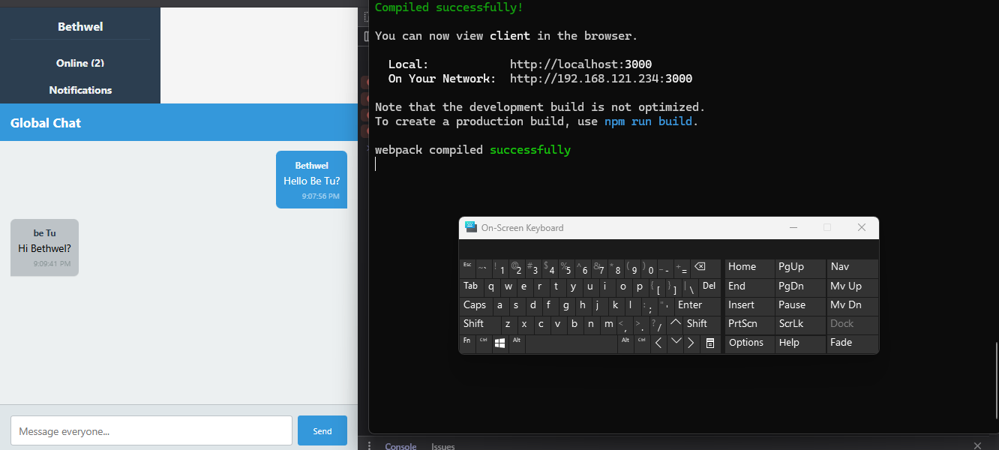

# Real-Time Chat Application with Socket.io



## Project Overview
A full-featured real-time chat application built with:
- **Frontend**: React.js
- **Backend**: Node.js + Express
- **Real-Time**: Socket.io
- **Styling**: CSS

## Features Implemented
✅ **Core Functionality**
- Real-time messaging (global and private)
- User authentication (username-based)
- Online user list with status indicators
- Message timestamps

✅ **Advanced Features**
- Typing indicators
- Read receipts
- Notifications (sound + visual)
- Message history/pagination

✅ **Technical Features**
- Automatic reconnection
- CORS protection
- Error handling
- Responsive design

## Setup Instructions

### Prerequisites
- Node.js v16+
- npm v8+

### Installation
1. Clone the repository:
```bash
   https://github.com/PLP-MERN-Stack-Development/week-5-web-sockets-assignment-bethwel3001
   cd socketio-chat-app
```
2. Set up the server and install dependencies:
```bash
   cd server
   npm install
```
3. Set up the client
```bash
cd ../client
npm install
```
**Running the app**
1. Start the server:
```bash
npm start
```
2. start the client:
```bash
npm start
```
3. Open two or more browser tabs and navigate to `http://localhost:3000` to view and communicate live.

**Configurations**
Create an .env file in server folder and add:
```bash
PORT=5000
CLIENT_URL=http://localhost:3000
```

client:
```bash
REACT_APP_SERVER_URL=http://localhost:5000
```

**Screenshots**

